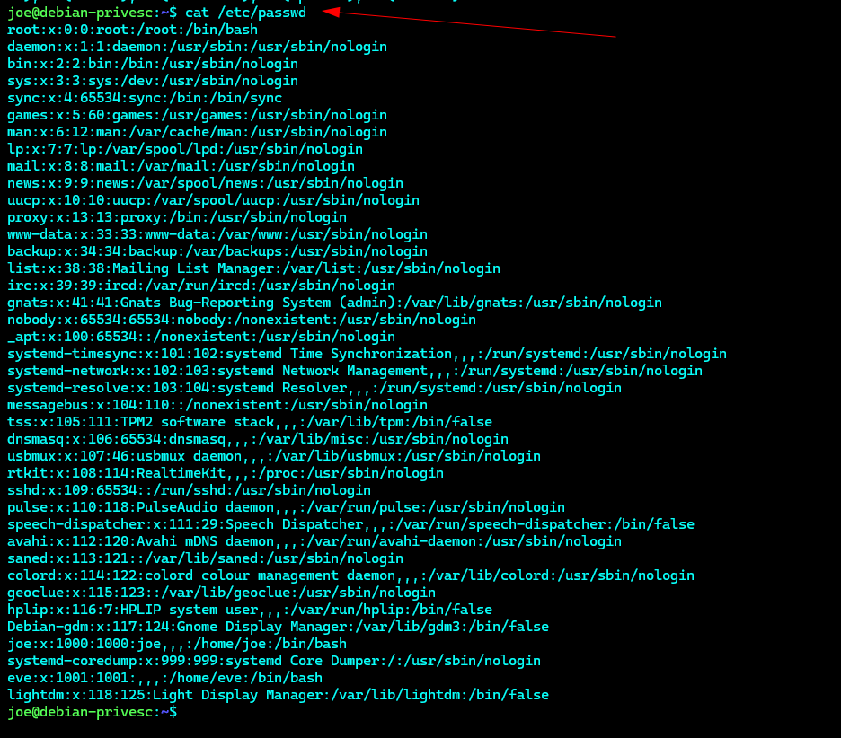
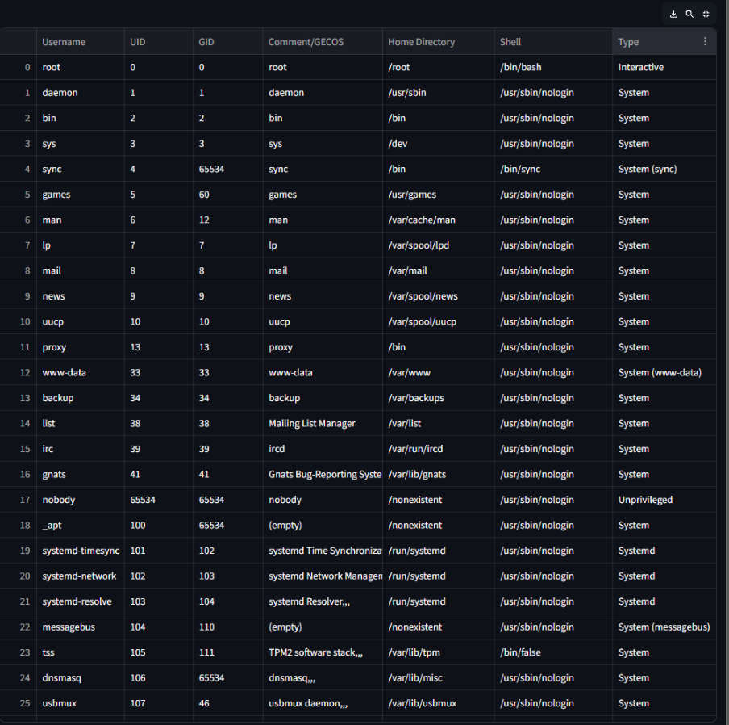

# scrollunlock_passwd
scrollunlock_passwd file parser

## Setup

### 1. Create a virtual environment

```bash
python3 -m venv venv
```

### 2. Activate the virtual environment

**Linux/macOS:**
```bash
source venv/bin/activate
```

**Windows:**
```bash
venv\Scripts\activate
```

### 3. Install required packages

```bash
pip install -r requirements.txt
```

### 4. Run the app

```bash
streamlit run passwd_parser.py
```

## How it works

Sometimes the `/etc/passwd` file is very big and difficult to read in a normal editor or terminal view. To make it easier to understand:

1. Open the `scrollunlock_passwd` parser app.
2. Copy the full contents of your `/etc/passwd` file.
3. Paste the contents into the parser app.
4. The app will display the data in a clear, structured format so you can quickly see the users and their details.

## Screenshots



